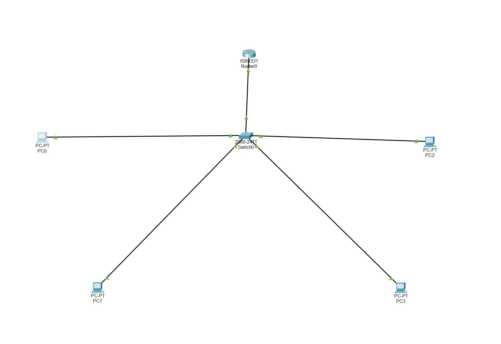
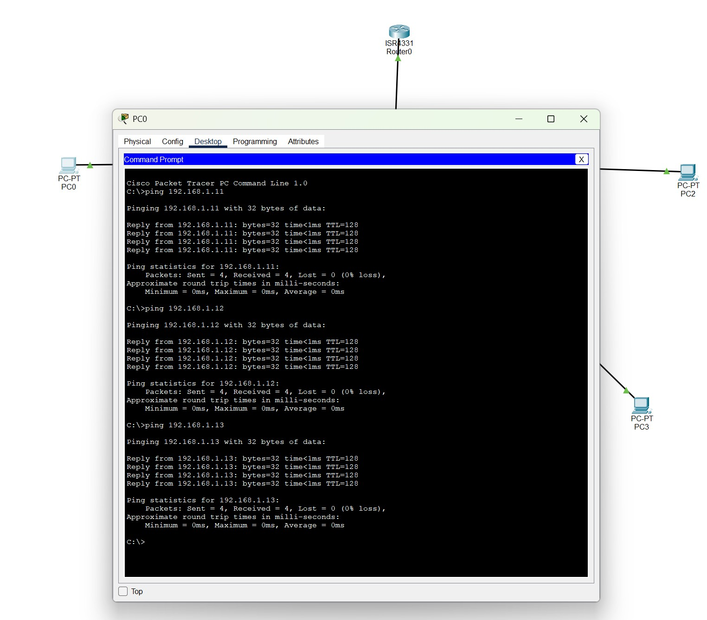

# Small Office Network

## Objective
Design and configure a small office network using Cisco Packet Tracer.

## Network Topology
- 1 Router
- 1 Switch
- 4 PCs

## IP Addressing

| Device | IP Address |
|----------|----------|
| Router | 192.168.1.1 |
| PC0 | 192.168.1.10 |
| PC1 | 192.168.1.11 |
| PC2 | 192.168.1.12 |
| PC3 | 192.168.1.13 |

## Skills Demonstrated
- IPv4 Addressing
- Subnet Masks
- Default Gateway Configuration
- Network Connectivity Testing
- Cisco Packet Tracer

## Verification
Successful ICMP ping tests were completed between all devices with 0% packet loss.

## Network Topology

## Connectivity Test

